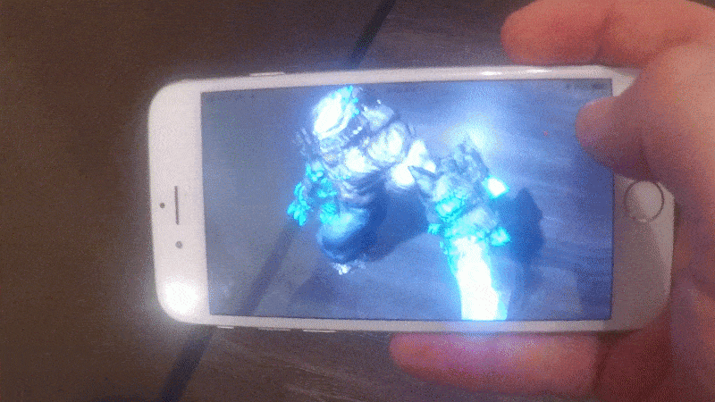

# ARKitXamarinDemo
[ARKit](https://developer.apple.com/arkit/) + UrhoSharp + Xamarin

 

## Prerequisites
 * iPhone 6S or later (
 * iOS 11 beta 3 or later
 * Xcode 9 beta 3 or later
 * [Xamarin.iOS 10.99](https://jenkins.mono-project.com/view/Xamarin.MaciOS/job/xamarin-macios-builds-xcode9/) or later
 * In Xamarin Studio change "Apple SDK" path to Xcode 9 beta

## Video (click to play):

